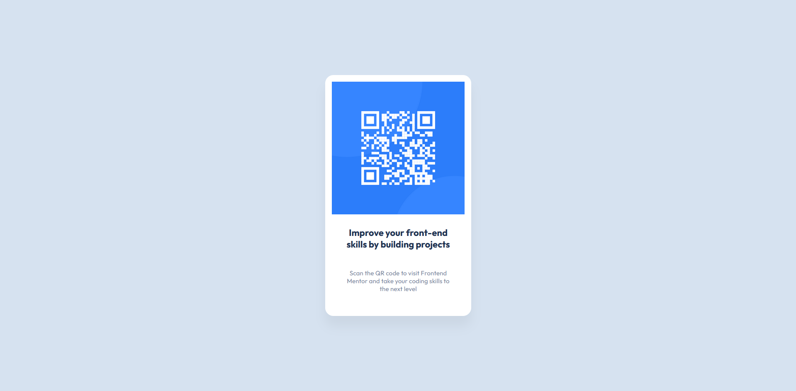

# Frontend Mentor - QR code component solution

This is a solution to the [QR code component challenge on Frontend Mentor](https://www.frontendmentor.io/challenges/qr-code-component-iux_sIO_H). Frontend Mentor challenges help you improve your coding skills by building realistic projects.

## Table of contents

- [Overview](#overview)
  - [Screenshot](#screenshot)
  - [Links](#links)
- [My process](#my-process)
  - [Built with](#built-with)
  - [What I learned](#what-i-learned)
  - [Continued development](#continued-development)
- [Author](#author)
- [Acknowledgments](#acknowledgments)

## Overview

### Screenshot

### Links

- Solution URL: [Github repo](https://github.com/ivanorsolic95/qr-code-component-frontend-mentor)
- Live Site URL: [Check out my site](https://qr-code-solution-frontend-mentor.netlify.app/)

## My process

### Built with

- Semantic HTML5 markup
- CSS custom properties
- Flexbox

### What I learned

By making this project, I learned how to work with Figma design files, convert them into HTML and CSS, and set up my workflow, when building web pages.

### Continued development

In the next challenges, besides the HTML and CSS, I will use React and Vue.js to solve the challenges and put my focus on the mobile-first design approach.

## Author

- Website - [Ivan Orsolic](https://ivanorsolic.live/)
- Frontend Mentor - [ivanorsolic95](https://www.frontendmentor.io/profile/ivanorsolic95)
- Twitter - [orsolic_ivan1](https://x.com/orsolic_ivan1)
